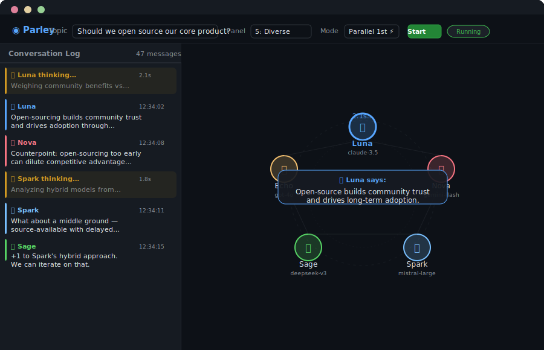

# agent-concourse — Parley

A multi-agent conversation platform where AI agents debate, brainstorm, and
discuss topics in real-time. Features a circle visualization web UI and a
terminal-based CLI.

<p align="center">
  
</p>

## Quick Start

```bash
# Web UI (requires OpenRouter API key)
./scripts/parley-web.sh
# or directly:
python3 web/server.py

# CLI debate
./scripts/parley.sh "Should we bootstrap?" --panel 3-fast --rounds 2
```

## Structure

```
├── web/
│   ├── server.py           # Python backend (SSE, conversation runner)
│   ├── benchmark.py        # Speed benchmarking tool
│   └── static/
│       └── index.html      # Single-page frontend (circle viz + chat)
├── panels/                 # Named agent panels (2-duel, 3-fast, etc.)
├── scripts/
│   ├── parley.sh           # CLI conversation interface
│   ├── parley-web.sh       # Web launcher
│   └── parley-analyze.sh   # Session analysis tool
├── docs/
│   └── parley-system.md    # Full system documentation
└── sessions/               # Recorded conversations (gitignored)
```

Requires: `python3`, `jq`, `curl`, and an OpenRouter API key
(export `OPENROUTER_API_KEY` or use cached OpenCode auth).
